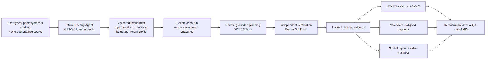
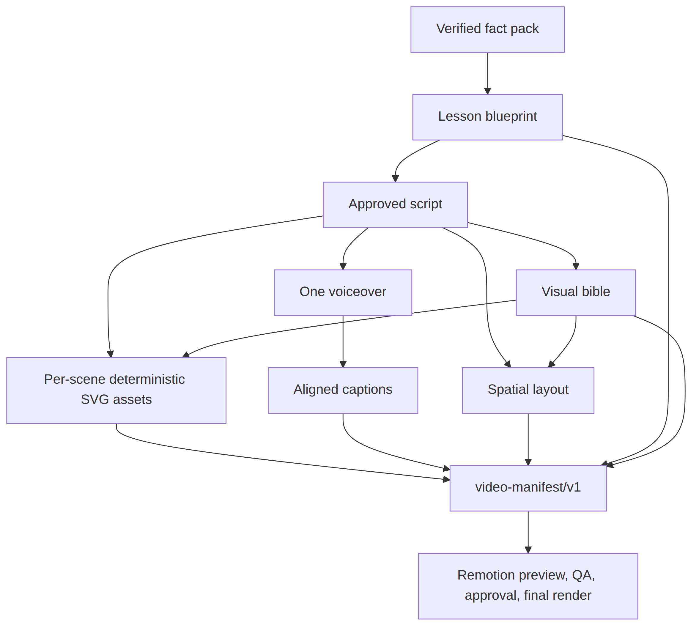

# Source-grounded lesson planning and structured scene manifests

This is the current, implementation-backed explanation of the **Source-grounded lesson planning and structured scene manifests** job. It now receives a complete, typed brief from the Chat intake path rather than asking the user to fill the long form first.

It does not create an MP4 by itself. Its job is to turn a frozen lesson brief and supplied evidence into verified planning artifacts that the asset, voice, layout, manifest, render, and QA stages can safely consume.

## The whole handoff at a glance

<!-- Rendered from assets/lesson-planning-handoff.mmd so PDF/print exporters
     that do not execute Mermaid still show the diagram. Regenerate with:
     mmdc -i assets/lesson-planning-handoff.mmd -o assets/lesson-planning-handoff.png -b white -s 3 -->



The two text-model responsibilities are intentionally separate:

| Job | Model and tools | Creates | Must not create |
| --- | --- | --- | --- |
| Intake Briefing Agent | GPT-5.6 Luna through AI Gateway; no tools | A compact `intake-brief/v1` metadata object | Research, citations, claims, narration, visual assets, or medical advice |
| Source-grounded lesson planning | GPT-5.6 Terra using only locked source-derived context | Fact pack, lesson blueprint, approved script, and visual bible | New unsupported facts, a final video, or unverified diagrams |
| Independent verification | Gemini 3.8 Flash | Fact-support and script-support decisions | A replacement lesson plan or rewritten narration |

## What the chat path gives this job

For a request like **`photosynthesis working`**, Chat requires one supplied source as either:

- pasted text after a `Source:` line;
- an HTTPS URL; or
- an uploaded TXT, Markdown, or text-based PDF.

The upload path extracts text deterministically, limits the file to 10 MiB and the extracted text to 100,000 characters, hashes both raw bytes and retained text, and stores file bytes privately. Chat does not search the web or invent a source.

Before Luna is called, the system creates a durable `intake_sessions` record. The agent receives only the request text and selected language. Its strict output is validated against `intake-brief/v1`:

```json
{
  "schemaVersion": "intake-brief/v1",
  "topic": "How photosynthesis works",
  "learningLevel": "Grade 8",
  "domain": "standard",
  "audienceCategory": "school",
  "durationSeconds": 60,
  "language": "en",
  "visualProfile": "Precise, calm educational motion graphics"
}
```

This is only a metadata brief. It contains no source text, claim, citation, scene, narration, timing, or image prompt. The system records the request hash, brief hash, model, prompt version, token counts when available, latency, and each attempt. A malformed or unavailable briefing fails visibly and does not create a video run.

Once valid, the service combines the brief with fixed run defaults—`16:9` and local destination—and the user source. It calls `createVideoRun`, which freezes the following `input-snapshot/v1` shape:

```json
{
  "schemaVersion": "input-snapshot/v1",
  "topic": "How photosynthesis works",
  "learningLevel": "Grade 8",
  "audienceCategory": "school",
  "language": "en",
  "durationSeconds": 60,
  "aspectRatio": "16:9",
  "domain": "standard",
  "visualProfile": "Precise, calm educational motion graphics",
  "requestedDestination": "local",
  "sourceIds": ["<source-document-uuid>"]
}
```

Changing any of these values or the source creates a different run; it does not mutate an existing lesson.

## What the source-grounded planning job creates

The following outputs are stored as versioned JSON artifacts tied to one `video_runs` record. They are database records, not Markdown files generated beside the project. Every persisted artifact includes a schema version, input hash, content hash, validation status, provenance, and timestamps.

| Order | Stage | Artifact created | What it contains | What receives it next |
| --- | --- | --- | --- | --- |
| 1 | Research | `source-evidence-map` / `source-evidence-map/v1` | Every retained source split into stable, hashed text segments with offsets | Fact-pack generation and fact verification |
| 2 | Research | `fact-pack` / `fact-pack/v2` | Bounded claims, caveats, and exact source/segment references for each supported claim | Independent fact verification, blueprint, script |
| 3 | Fact verification | `fact-verification` / `fact-verification/v2` | One independent supported/not-supported result for every fact-pack claim | Claim records, release evidence, planning gate |
| 4 | Blueprint | `lesson-blueprint` / `lesson-blueprint/v1` | Learning objective, prerequisites, ordered scene IDs, scene purposes, claim IDs, and visual beats | Script and manifest assembly |
| 5 | Script | `approved-script` / `approved-script/v2` | Canonical narration lines, each tied to a scene ID, claim IDs, and a visual action | Voiceover, visual bible, assets, layout, manifest |
| 6 | Script verification | Validation result is checked inline; provider usage is recorded | Each narration line must be supported by the claims it names | Gate before the approved script is persisted |
| 7 | Visual bible | `visual-bible` / `visual-bible/v1` | Palette, typography, caption safe area, persistent entities, camera behavior, and forbidden visual patterns | Deterministic SVG assets, layout, captions, manifest |

The fact verifier is a stored artifact. Script verification currently runs and blocks unsafe narration, but the code does **not yet persist** a separate `script-verification` artifact; it records the provider attempt and only persists the approved script after the check passes. That is an intentional current-state distinction, not a claim of a missing artifact being present.

## Worked example: what moves through the planner

The objects below illustrate structure and links only. They are not approved photosynthesis content unless the user-provided source supports them.

### 1. Source evidence map

The planner never receives a free-form web search result. Research first locks the source into deterministic segments:

```json
{
  "schemaVersion": "source-evidence-map/v1",
  "sources": [
    {
      "sourceId": "<source-document-uuid>",
      "sourceHash": "<64-character-content-hash>",
      "segments": [
        {
          "id": "<stable-segment-id>",
          "ordinal": 0,
          "startOffset": 0,
          "endOffset": 184,
          "text": "<the retained user-supplied source text>"
        }
      ]
    }
  ]
}
```

### 2. Fact pack

Terra receives the segmented source and may output only claims linked to those segments:

```json
{
  "schemaVersion": "fact-pack/v2",
  "claims": [
    {
      "id": "<claim-uuid>",
      "text": "<a claim supported by the supplied source>",
      "evidence": {
        "sourceId": "<source-document-uuid>",
        "sourceHash": "<64-character-content-hash>",
        "segmentIds": ["<stable-segment-id>"],
        "locator": "supplied source, segment 1"
      },
      "critical": true
    }
  ],
  "caveats": []
}
```

Gemini independently checks every proposed claim against only its cited source segments. If one is unsupported, the run fails at this point; it does not continue with a plausible-sounding explanation.

### 3. Lesson blueprint — the first structured scene plan

The blueprint converts verified facts into an educational sequence. It is the first scene-oriented artifact, but it is not yet the renderer manifest.

```json
{
  "schemaVersion": "lesson-blueprint/v1",
  "objective": "Explain the supported inputs, transformation, and outputs of photosynthesis.",
  "prerequisites": ["Plants use leaves"],
  "scenes": [
    {
      "id": "<scene-1-uuid>",
      "order": 0,
      "purpose": "Introduce the learner question.",
      "claimIds": [],
      "visualBeat": "A leaf appears and a question becomes a simple process diagram."
    },
    {
      "id": "<scene-2-uuid>",
      "order": 1,
      "purpose": "Explain one supported part of the process.",
      "claimIds": ["<claim-uuid>"],
      "visualBeat": "Show an input arrow moving into the persistent leaf."
    }
  ]
}
```

It forwards stable scene IDs, ordering, claimed evidence, and intended canvas changes. It does **not** include pixel coordinates, asset IDs, captions, word timings, or MP4 timings.

### 4. Approved script

The script stage receives a minimal projection of the blueprint and the claims needed by each scene. It produces the one canonical narration representation:

```json
{
  "schemaVersion": "approved-script/v2",
  "narration": [
    {
      "id": "<line-uuid>",
      "sceneId": "<scene-2-uuid>",
      "text": "<a source-supported, learner-appropriate explanation>",
      "claimIds": ["<claim-uuid>"],
      "visualAction": "Draw the supported process element beside the persistent leaf."
    }
  ]
}
```

Gemini verifies every line before this script is saved. Later stages derive the complete TTS text deterministically from these lines, so there is no second, drifting narration copy.

### 5. Visual bible

The visual bible locks the visual language before anything is rendered:

```json
{
  "schemaVersion": "visual-bible/v1",
  "canvasTexture": "warm off-white paper",
  "lineStyle": "rounded dark-green marker strokes",
  "palette": ["#155E3A", "#F2C94C", "#5DADE2"],
  "typography": {
    "heading": "bold rounded sans serif",
    "body": "clear sans serif",
    "caption": "high-contrast sans serif"
  },
  "captionSafeArea": {"top": 0.08, "right": 0.07, "bottom": 0.12, "left": 0.07},
  "persistentEntities": [
    {"id": "leaf-01", "description": "The same leaf remains visible across related scenes."}
  ],
  "camera": {"behavior": "one evolving canvas", "transitions": ["draw-on", "gentle pan"]},
  "prohibitedVisualPatterns": ["text baked into generated illustrations"]
}
```

## What is forwarded after planning

<!-- Rendered from assets/planning-forwarded.mmd so PDF/print exporters
     that do not execute Mermaid still show the diagram. Regenerate with:
     mmdc -i assets/planning-forwarded.mmd -o assets/planning-forwarded.png -b white -s 3 -->



| Downstream receiver | Planning inputs it consumes | New output it creates |
| --- | --- | --- |
| Asset stage | Approved script + visual bible | One selected private SVG asset for each narrated scene. The current implementation is deterministic SVG and omits optional generated illustrations. |
| Voiceover | Canonical approved-script narration | One MP3 plus provider word alignment. |
| Captions | Voice word alignment | Caption cues tied to exact aligned word indexes. |
| Spatial layout | Approved script + run aspect ratio | Resolved canvas and layer bounds per scene. |
| Manifest assembly | Blueprint, script, visual bible, selected assets, layout, voiceover, captions | `video-manifest/v1`: scene start/end times, layer asset IDs, caption cues, safe area, and narration asset ID. |
| Remotion/render QA | Locked video manifest and verified private assets | Preview MP4, QA evidence, approval decision, final MP4, and a release record. |

The precise scene timings are not guessed by the planner. They are assembled after TTS returns word alignment. The final `video-manifest/v1` is the renderer contract; the blueprint is the educational-scene contract that comes before it.

## Current-state boundaries

This document distinguishes what the repository does today from what its contracts may support later:

- `scene-plan/v1` and `scene-asset-brief/v1` schemas exist, but current stages do not generate or persist those artifacts yet.
- The current asset stage creates deterministic SVG scene assets. They are reliable renderer inputs, but they are not yet a complete semantic, labelled photosynthesis diagram component.
- Factual diagrams, labels, equations, charts, arrows, and captions must remain typed SVG/Remotion work. They must not be delegated to image generation.
- The worker currently advances stage jobs in its declared order. Per-scene SVG creation is concurrent inside the asset stage; whole downstream stages are not yet independently dispatched in parallel.
- Medical requests are classified conservatively at intake and remain educational-only; clinician approval is still required before medical publication.

## Records created for audit and reproduction

| Record location | Why it exists |
| --- | --- |
| `intake_sessions`, `intake_attempts` | Durable chat request, validated brief, hashes, Luna route, usage, latency, and retry outcome |
| `video_runs`, `source_documents` | Frozen snapshot, source identity, private object key when uploaded, text/raw-byte hashes, and retrieval metadata |
| `artifacts`, `artifact_attempts`, `stage_checkpoints` | Versioned planning outputs, model/provider route, validation, retries, and locked dependency hashes |
| `source_claims` | Verified claim-to-source links used by the final release record |
| `provider_usage` | Request identifiers, model, token/character accounting, cost metadata, latency, and outcome |
| `media_assets`, `render_outputs` | Selected SVG/audio assets and final render bytes with provenance and hashes |
| Release record artifact | Reproducible run snapshot, intake provenance, source links, artifacts, QA, approval, usage, and output hashes |

## Implementation map

- [Chat intake API](../apps/web/src/app/api/intake-sessions/route.ts) — source parsing/upload handling and durable session creation.
- [Intake orchestrator](../packages/pipeline/src/intake.ts) — Luna call, validated handoff, attempts, retries, and video-run creation.
- [Pipeline stages](../packages/pipeline/src/stages.ts) — research, fact verification, blueprint, script, visual bible, assets, voice, captions, layout, manifest, QA, and release record.
- [Typed contracts](../packages/contracts/src/index.ts) — exact schemas for intake, planning, layout, and renderer inputs.
- [Database schema](../packages/db/src/schema.ts) — durable records and provenance fields.
- [Required process](video-generation-process.md) — governing dependency order and release policy.
