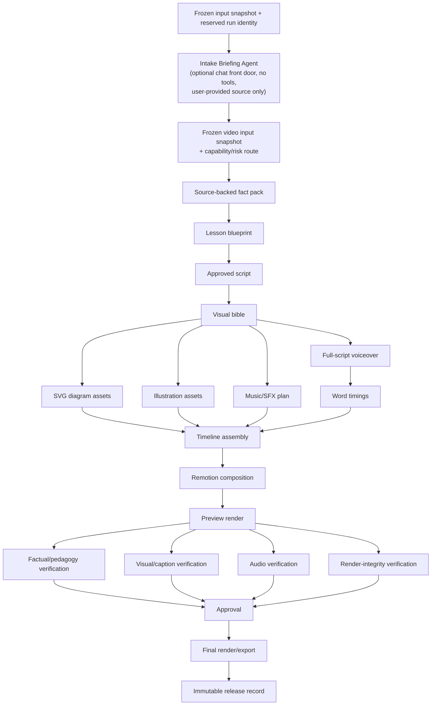

# Educational Video Generation Process

This process creates a continuous whiteboard/motion-graphics lesson, not a slideshow. Remotion owns deterministic typography, diagrams, animation, captions, and timing. Image models create only illustrative assets that benefit from generative art.

Models propose bounded artifacts; typed validation, source-grounded verification, deterministic rendering, and release gates decide whether an artifact may advance. A weak, unavailable, or malformed model response must never silently become a lower-quality released lesson.

## Change control

This is a governing document under [`AGENTS.md`](../AGENTS.md). Any request to alter a required stage, its ordering, parallelism rules, reliability controls, or release behavior must be explained and explicitly confirmed with the question tool when available before implementation. Update the benchmark and model-recommendation documents in the same approved change whenever this workflow changes their requirements.

## Reliability contract

Every generation is one durable video run. This workflow deliberately does not define classroom, collaboration, chat-session, multi-user, or browser-session behavior.

Before any billable or irreversible work, the system must reserve a unique intake-session or run/output identity, freeze an immutable input snapshot, validate required provider/model/storage/renderer/approval capabilities, and persist a versioned manifest in `queued` state. The snapshot contains intake settings, supplied sources, requested destination, and selected capability configuration. Chat requests reserve an `intake_sessions` record before the Intake Briefing Agent is called; the later video run is created only from the validated brief.

Each stage consumes only locked upstream artifacts and produces a versioned typed artifact. Its checkpoint records input and output hashes, schema version, prompt/template and model/provider versions, attempt count, validation evidence, source links where applicable, cost, latency, timestamps, and an explicit outcome. Generated bytes additionally require a content hash, MIME type, size, and provenance.

Provider context is also versioned. The research stage may receive the complete immutable source snapshot once and must emit a lossless source-evidence map. Later model calls receive only the smallest deterministic projection of locked artifacts needed by that stage plus the exact source segments referenced by the claims under review. Projection metadata records artifact hashes, segment IDs, item counts, and character counts; it must never replace evidence with an unverified model summary or silently truncate source text. Provider usage records input, cached-input, output, and reasoning tokens where available, modality-specific units such as TTS characters, request identifiers, pricing-version metadata, cost, latency, and outcome without storing duplicate private prompts.

The approved script stores narration lines as the single canonical text representation. Full narration text for TTS is derived deterministically from those lines, so a downstream stage cannot create a second divergent copy of the script.

Run status is explicit: `queued`, `running`, `awaiting_approval`, `failed`, or `completed`. A restart or expired lease must recover from the latest valid checkpoint or leave the run visibly failed; it must never appear successful. Replaying a stage with the same locked inputs must use stable artifact identities and idempotent writes, so it cannot duplicate assets or overwrite a newer valid artifact.

### Validation, retry, and fallback rules

- Treat model text, tool output, external URLs, generated media, and provider metadata as untrusted input.
- Validate every generated artifact against its stage schema before marking it valid. Deterministic normalization may repair transport-only defects, such as a fenced JSON wrapper; it must not invent facts, labels, narration, timings, or visual meaning.
- Retry only bounded, classified transient failures—rate limits, timeouts, temporary provider errors, and network errors—with exponential backoff and jitter. Persist every attempt. Do not retry cancellation, authentication/configuration errors, quota exhaustion, malformed inputs, or failed safety/release gates as though they were transient.
- An invalid model artifact may be regenerated as a new bounded attempt with the validation error, but it is never promoted by syntactic repair alone.
- Fact packs, blueprints, approved scripts, voice tracks, timings, project manifests, preview renders, QA reports, and final renders are critical artifacts: no valid artifact means the run is blocked or failed.
- Decorative illustrations and optional music/SFX may fall back only to an approved existing asset, deterministic Remotion/SVG treatment, or omission. Record the reason and choice. Factual diagrams, labels, equations, charts, and captions must always use typed SVG/Remotion components.
- A valid partial result is not a completed video. The release record must name every required artifact and every approved optional fallback.

## Dependency map

Parallel work begins only after its inputs are locked. A scene may not generate images before the visual bible is approved, and Remotion may not finalize timing before the voice track is available. A failed downstream artifact may be regenerated without reopening a locked upstream artifact only when its input contract remains valid.

## Sub-processes

### 1. Chat intake briefing — sequential, optional front door

The Chat toggle accepts one request, a language selector, and one user-provided source: TXT/Markdown/PDF upload, an authoritative URL, or a `Source:` text block. The durable Intake Briefing Agent (`intake-briefing-agent`) receives only the request and selected language, uses GPT-5.6 Luna through the AI Gateway, has no tools, and returns the typed `intake-brief/v1` object: topic, learner level, risk domain, audience, duration, language, and visual profile. It must not research, cite, write narration, create assets, or invent source material. The service stores the request hash, brief hash, model/prompt version, usage, latency, and every bounded attempt in `intake_sessions`/`intake_attempts`. A valid brief is then passed to the normal run creator with the supplied source; a failed or unavailable briefing never starts video generation.

Source files are extracted deterministically (UTF-8 TXT/Markdown or text-based PDF), size- and character-limited, hashed, and stored privately before the queued session is dispatched. The chat front door does not perform web search. URL retrieval and source-grounded research remain later pipeline responsibilities and must still pass their existing gates.

### 2. Intake and risk routing — sequential

Collect topic, target learner level, language, duration, aspect ratio, brand/style profile, and destination from the validated brief or the advanced form. Classify the domain as standard, engineering, medical, or client-production. Freeze this input, reserve the run/output identity, and fail early if required providers, credentials, storage, render capacity, or approval paths are unavailable.

**Why:** a primary-school photosynthesis lesson and a medical-school pharmacology lesson cannot share the same source, safety, or review policy.

### 2. Research and fact pack — sequential

Retrieve authoritative, topic-appropriate sources. Extract only the facts, definitions, calculations, caveats, and citations required for the stated learning objective. Record material claim-to-source links, stable source locators or snapshots, retrieval time, and source suitability. Independently verify every material claim before planning.

**Why:** the script must be written from evidence, rather than asking a model to remember science or medicine from training data.

### 3. Lesson blueprint — sequential

Create the measurable learning objective, learner prerequisites, hook, explanation arc, recap, and optional knowledge-check. Divide the explanation into scenes and visual beats; each beat introduces one idea and one meaningful canvas change. Validate the typed blueprint for learning-objective coverage, prerequisites, scene order, and claim references before locking it.

**Why:** this is where the system becomes a teacher rather than a generic story generator.

### 4. Script and storyboard approval — sequential

Write spoken narration from the fact pack, then attach each line to a scene purpose, on-screen text, visual action, and source claims. Validate factual claims, reading level, duration, and safety policy before the script becomes immutable. A separate verifier or deterministic claim check must evaluate it against the fact pack; the script-writing model cannot be the only authority.

**Why:** changing the script after audio, captions, and scene assets exist causes needless cost and sync errors.

### 5. Visual bible — sequential

Create one project-level specification: canvas texture, marker/line style, palette, typography, character/object sheets, icon rules, camera behavior, caption design, and prohibited visual patterns. Define persistent entities such as the same leaf, sun, molecule, circuit, or patient diagram. Lock the visual-bible version with the script and attach it to every downstream asset brief.

**Why:** it prevents visual drift and lets scenes feel like one evolving whiteboard.

### 6. Asset production — parallel by scene after the visual bible locks

- **SVG/Remotion diagrams:** Build molecules, arrows, charts, labels, equations, and annotated processes as editable vector components.
- **Illustrations:** Generate only scene illustrations, characters, or textures; provide the visual bible and relevant reference assets with every prompt. Verify returned media type, dimensions, bytes, content hash, provenance, and prompt/style adherence before attaching it to the run.
- **Sound plan:** Select minimal music and sound effects, leaving narration intelligible. Treat this as optional enrichment with an explicit fallback or omission record.

Each candidate asset has a stable identity derived from the run, scene, role, and attempt. Multiple candidates may be evaluated in parallel, but only a validated selected asset may become a scene reference.

**Why:** these outputs have no dependency on one another once scene direction is fixed. Vectors protect factual accuracy; illustrations add warmth and context.

### 7. Voiceover and captions — sequential, then derivation

Generate one voiceover for the complete approved narration with pronunciation notes. Validate audio bytes, duration, loudness, voice identity, and curated-domain-term pronunciation. Obtain word/character alignment from the TTS response, derive phrase captions, and reserve short pauses for diagram inspection. Check captions against the locked script; do not independently paraphrase them or treat guessed timing as equivalent to rendered narration.

**Why:** one voice track preserves tone, pacing, and transitions. Captions must come from the rendered narration, not an independently paraphrased script.

### 8. Timeline assembly and composition — sequential

Convert scene durations, audio timings, captions, camera moves, selected asset identifiers, and transitions into a typed versioned project manifest. Remotion renders the sequence as a persistent canvas: draw/reveal paths, retain established objects, pan/zoom to the next concept, and use explicit transitions only where the teaching context changes. The composition must consume verified manifest references, never unverified provider URLs; persist the renderer, composition, dependency, and export-profile versions required to reproduce a render.

**Why:** a manifest makes renders reproducible and lets the renderer remain deterministic even when upstream AI output varies.

### 9. Quality assurance — parallel checks after preview render

Render a preview from the locked manifest, then run independent checks concurrently:

- schema, artifact-completeness, source-claim, and policy validation;
- factual/pedagogy review against the fact pack and learning objective;
- visual continuity, diagram semantics, safe-area, caption-overlap, and generated-text inspection;
- audio duration, pronunciation, word-timing, loudness, and music-ducking checks;
- render integrity, asset availability, and export-profile tests.

Every finding must identify the failed artifact, rule, evidence, and remediation. Regenerate or replace only the earliest failed downstream artifact whose inputs remain locked, then rerun dependent checks. A validator must not mark its own generated artifact verified without an independent source, deterministic test, or separately routed verifier.

**Why:** each validator sees a different failure class; a single model cannot reliably judge its own output.

### 10. Approval, render, and feedback loop — sequential

Require the correct approval level, then render the MP4 and optional SRT/transcript from the approved manifest. The immutable release record must preserve the input snapshot, source pack and claim links, prompt/template and model/provider versions, asset provenance and hashes, attempt/retry history, manifest, QA evidence, approval, cost, latency, and final-output hashes. A failed, stale, blocked, or incomplete run must remain visibly non-publishable. Feed viewer retention, quiz results, and reviewer feedback into the regression suite.

**Why:** reproducibility and measured learning outcomes are necessary to improve the system safely.

## Required parallelism rules

| May run in parallel | Must wait for |
| --- | --- |
| Per-scene SVG assets, illustrations, and sound planning | Approved script and visual bible |
| Independent factual, pedagogy, visual, and audio QA | Preview render and its manifest |
| Multiple candidates for one approved optional illustration | Scene asset brief, references, and candidate identity |
| Multiple render resolutions/formats | Approved master composition |

| Must remain sequential | Reason |
| --- | --- |
| Chat briefing -> frozen video input snapshot/capability route -> research -> lesson blueprint -> script approval | Prevents mixed inputs and unsupported narration; the briefing cannot become a hidden research step. |
| Script approval -> complete voiceover -> caption timing | Prevents visual/audio/caption drift. |
| Visual bible -> persistent asset generation | Preserves scene continuity. |
| Asset/timing completion -> final timeline -> final render | Keeps the composition deterministic. |
| QA approval -> publication | Prevents known errors from reaching learners. |

On failure, resume from the latest validated checkpoint only after rechecking that its locked inputs, dependencies, and provider capabilities remain valid. Never parallelize a retry with an active attempt for the same artifact identity, and never overwrite a validated artifact without recording a new version and reason for replacement.
